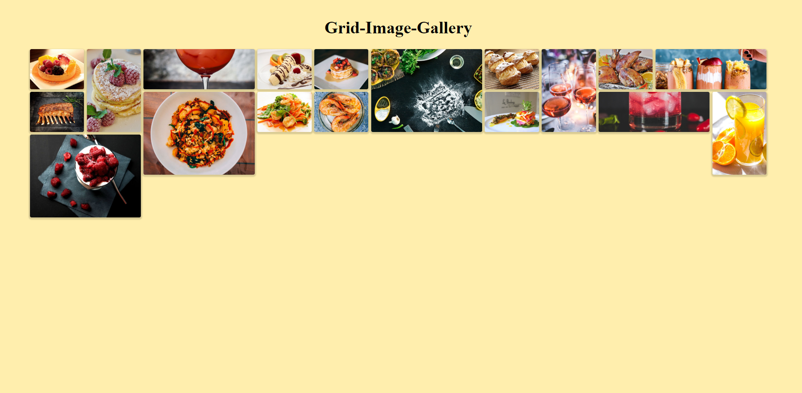

# Image-Gallery
Two image gallery developed using css topics flexbox and grid.
Both are separated into two different folders with basic page styling in basic.css and gallery styling in index.css

# Flexbox-image-gallery

# Grid-image-galllery

# License

This project is licensed under MIT Licence 
read [this](https://github.com/utkarsh1810/Development-trashs/community/license/new?branch=master) for more details.

